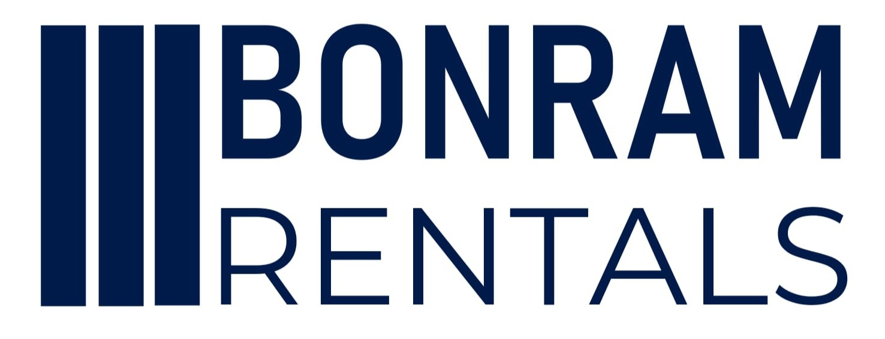
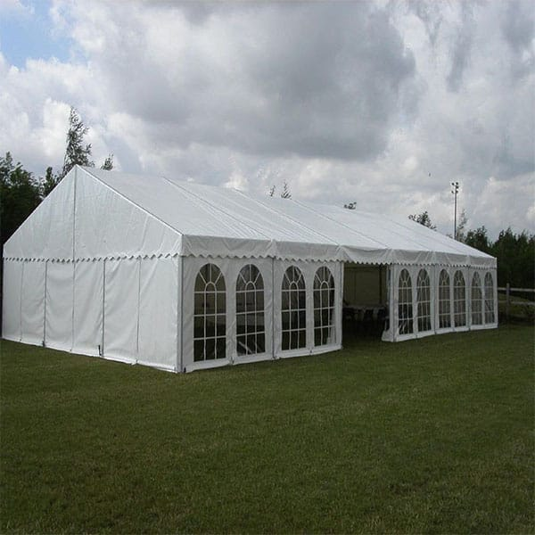
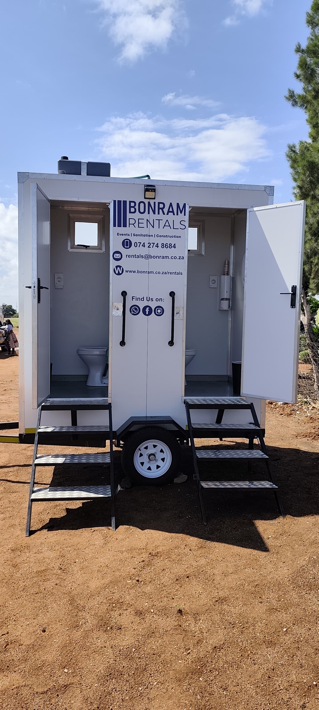
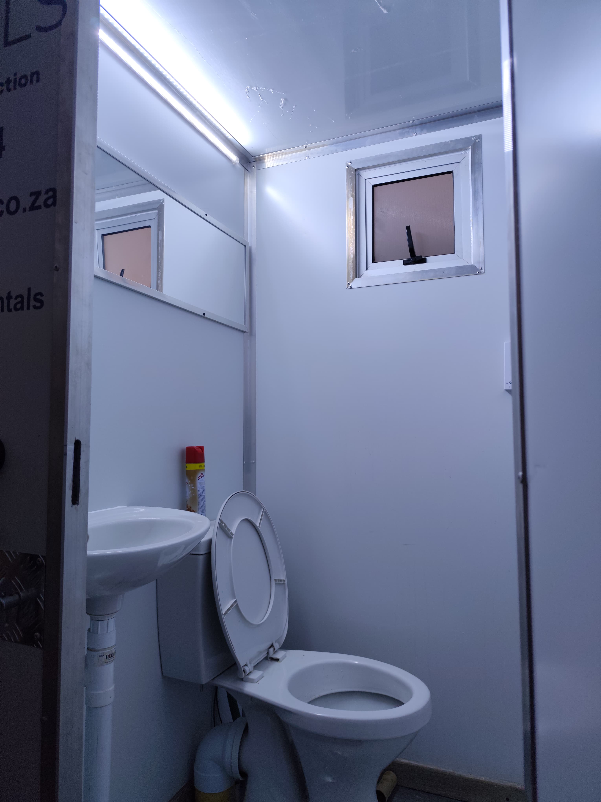
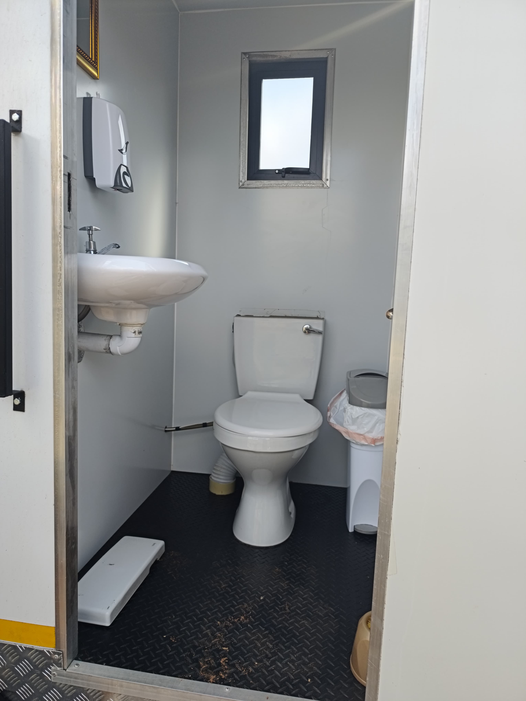
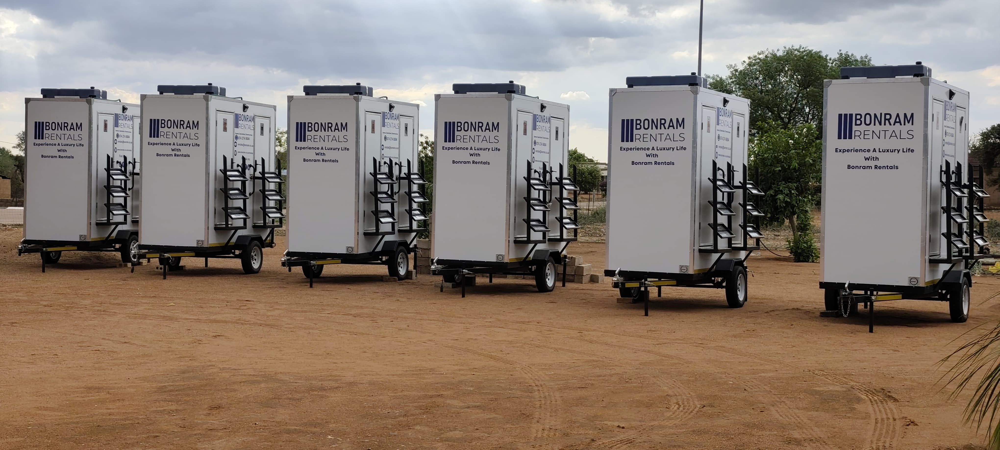
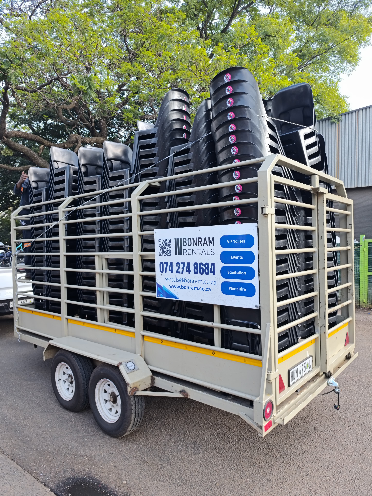
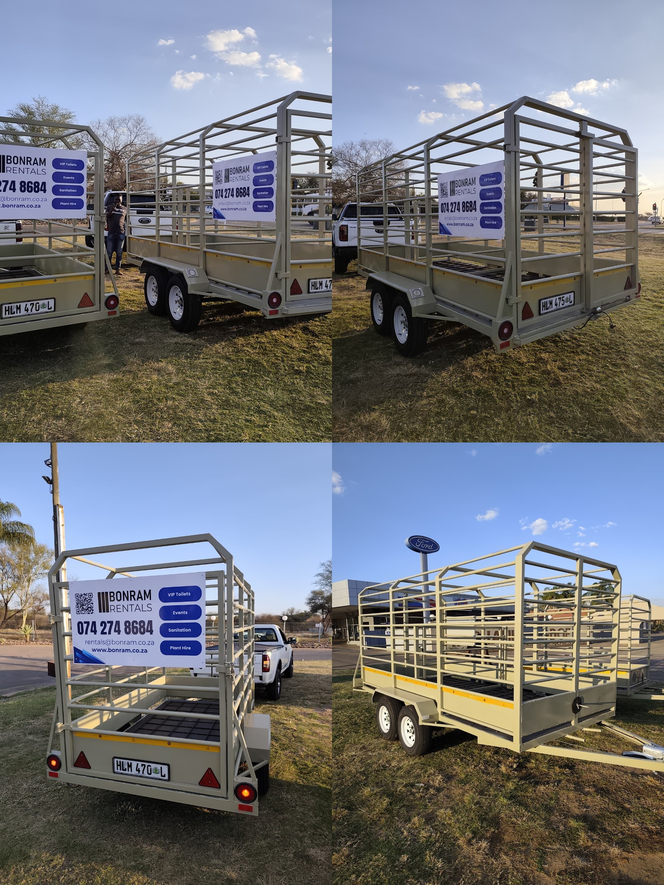
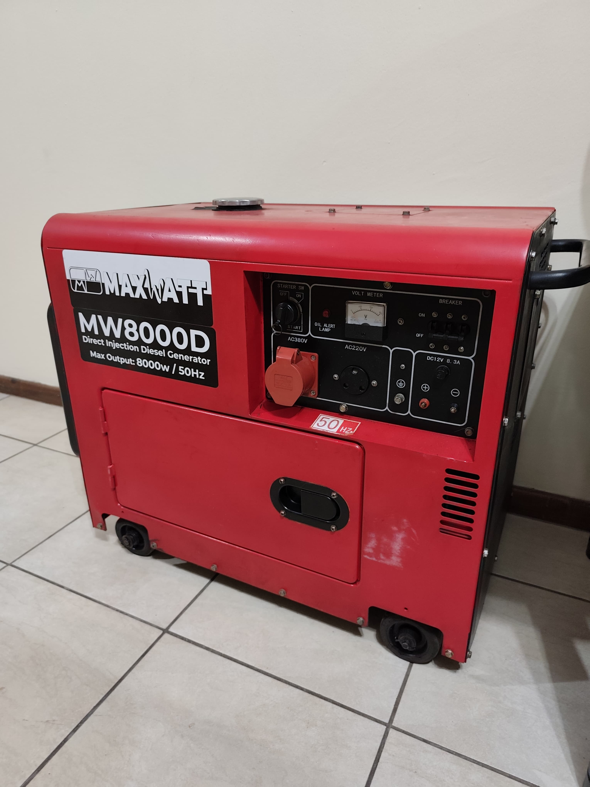

# BONRAM RENTALS - Equipment Catalog with Visual Assets

**Date:** February 2026  
**Purpose:** Visual inventory for marketing materials and presentations

---

## Visual Brand Assets

### Logo & Branding

**Primary Logo:**


**Brand Identity:**
- **Color:** Navy Blue (matches brand guide)
- **Design:** Three vertical bars + "BONRAM RENTALS" wordmark
- **Style:** Clean, modern, professional, institutional

**Branding Application:**
- All equipment branded with Bonram logo
- Consistent navy blue color scheme
- Professional signage on trailers and units

---

## Equipment Portfolio with Images

### 1. Event Tents & Structures

**Elegant White Event Tent**



**Features:**
- Large capacity for weddings, corporate events, and functions
- Elegant white exterior with decorative scalloped edges
- Arched window panels for natural light and ventilation
- Professional installation on grass or paved surfaces
- Weather-resistant construction

**Perfect For:**
- Weddings and celebrations
- Corporate gatherings
- Government functions
- Outdoor events requiring shelter

**Brand Alignment:** Premium, elegant, suitable for high-end events (luxury B2C positioning)

---

### 2. VIP Toilet Facilities

**Modern VIP Toilet Trailer (Exterior)**



**Features:**
- Professional white trailer-mounted units
- Bonram branding with contact information
- Easy access via steps
- Trailer-mounted for easy positioning
- Clean, modern exterior design

**Interior - Premium View**



**Interior Features:**
- Full porcelain fixtures (sink and toilet)
- Modern hand sanitizer dispenser
- Window for natural light and ventilation
- Under-sink storage
- White walls with black flooring
- Waste bin provided

**Interior - Alternative View**



**Additional Details:**
- Clean, spacious interior
- Professional-grade fixtures
- Elegant black flooring
- Ambient lighting capability
- Toilet paper holder and accessories

**Fleet Scale**



**Capacity:**
- Multiple units available
- Can service large events
- Fleet shows professional operation scale
- Trailer-mounted for flexible placement

**Perfect For:**
- VIP guests at corporate events
- Wedding parties and special occasions
- Government functions requiring premium facilities
- Any event where guest comfort is priority

**Brand Alignment:** Premium service, institutional quality, hygiene focus (aligns with both B2B credibility and B2C luxury positioning)

---

### 3. Seating & Furniture Transportation

**Chair Transport Trailers**



**Features:**
- Professional stacked black plastic chairs
- Bonram-branded transport trailer
- High-capacity cargo system
- Safety railings for secure transport
- Visible contact information (074 274 8684)

**Transport Fleet - Multiple Views**



**Logistics Capability:**
- Multiple trailers for large events
- Efficient stacking system
- Professional transportation
- Quick deployment capability
- Safety-compliant cargo management

**Perfect For:**
- Large gatherings requiring substantial seating
- Corporate conferences
- Government events
- Weddings and functions
- Construction site offices

**Brand Alignment:** Professional logistics, scale capability (demonstrates ability to handle institutional projects)

---

### 4. Power Solutions

**Generator - MW8000D**



**Specifications:**
- **Model:** MaxWatt MW8000D
- **Type:** Silent Diesel Generator
- **Capacity:** 8000W / 8kW
- **Features:** Control panel with monitoring
- **Color:** Red housing
- **Portability:** Wheeled for easy positioning

**Applications:**
- Event power backup
- Sound system and lighting support
- Construction site power
- Emergency backup
- Remote location events

**Perfect For:**
- Events requiring reliable power
- Areas without grid access
- Professional audio/visual setups
- Outdoor functions
- Government and corporate events

**Brand Alignment:** Reliability, professional-grade equipment, comprehensive event support

---

### 5. Sound Systems

**Professional Audio Equipment**

**Features:**
- Complete PA (Public Address) systems
- Microphones (wireless and wired)
- Mixing consoles
- Speakers and amplifiers
- Professional audio setup and operation

**Applications:**
- Speeches and presentations
- Wedding ceremonies and receptions
- Corporate events and conferences
- Government functions
- Outdoor events

**Perfect For:**
- Events requiring clear audio
- Multi-speaker programs
- Musical performances
- Announcements and presentations

**Brand Alignment:** Comprehensive event support, professional-grade equipment

---

### 6. Stage and Lighting Equipment

**Complete Production Support**

**Stage Features:**
- Modular staging platforms
- Various sizes and configurations
- Safe, stable construction
- Professional appearance

**Lighting Features:**
- Event lighting systems
- Uplighting and accent lighting
- Professional setup and operation
- Suitable for indoor and outdoor events

**Applications:**
- Performances and presentations
- Award ceremonies
- Corporate product launches
- Wedding receptions
- Government events

**Perfect For:**
- Events requiring elevated platforms
- Professional presentations
- Performances and entertainment
- Creating ambiance and atmosphere

**Brand Alignment:** Full-service event solutions, professional production quality

---

### 7. Tables

**Various Configurations Available**

**Features:**
- Multiple sizes and shapes
- Round tables (for dining/socializing)
- Rectangular tables (for conferences/displays)
- Professional quality
- Clean and well-maintained

**Applications:**
- Dining events
- Conference settings
- Display tables
- Registration desks
- Buffet service

**Perfect For:**
- Weddings and receptions
- Corporate functions
- Government events
- Trade shows and exhibitions

**Brand Alignment:** Comprehensive event furnishings, flexible configurations

---

### 8. Portable Toilets (Standard)

**Essential Sanitation for All Events**

**Features:**
- Standard portable toilet units
- Clean and hygienic
- Regular maintenance
- Cost-effective solution
- High-capacity options available

**Applications:**
- Construction sites
- Large outdoor events
- Festivals and gatherings
- Remote locations
- Emergency situations

**Perfect For:**
- Budget-conscious clients
- Construction projects
- Large-scale events requiring multiple units
- Locations without permanent facilities

**Brand Alignment:** Comprehensive service range, hygiene focus, accessible to all budgets

---

### 9. Shuttle Services

**Guest Transportation Solutions**

**Features:**
- Professional shuttle service
- Reliable transportation
- Event coordination
- Safe and comfortable

**Applications:**
- Wedding guest transportation
- Corporate event shuttles
- Parking to venue transfers
- Airport pickups for VIP guests

**Perfect For:**
- Large events with parking challenges
- Multi-venue events
- VIP guest services
- Ensuring guest convenience

**Brand Alignment:** Comprehensive event logistics, premium service

---

### 10. Mobile Freezer

**Catering Support Equipment**

**Features:**
- Mobile freezer unit
- Temperature controlled
- Reliable power supply
- Food safety compliant

**Applications:**
- Catered events
- Food service support
- Outdoor functions
- Extended event duration

**Perfect For:**
- Large catered events
- Outdoor weddings and functions
- Corporate catering
- Locations without kitchen facilities

**Brand Alignment:** Complete event support, professional catering solutions

---

### 11. Artificial Grass Carpet

**Elegant Ground Covering**

**Features:**
- Professional artificial grass
- Clean, elegant appearance
- Various sizes available
- Weather-resistant

**Applications:**
- Outdoor event floors
- Aisle runners for weddings
- VIP areas
- Ground covering for elegant events

**Perfect For:**
- Outdoor weddings on natural ground
- Creating elegant pathways
- Covering uneven or unsightly surfaces
- Enhanced event aesthetics

**Brand Alignment:** Attention to detail, premium event finishing touches

---

## Equipment Categories Summary

### Current Visual Documentation:

✅ **Event Structures**
- White event tents (elegant, premium)

✅ **Sanitation Facilities**
- VIP toilet trailers (premium, modern)
- Interior and exterior documentation
- Fleet capacity demonstrated

✅ **Seating & Furniture**
- Black plastic chairs
- Professional transport system

✅ **Power Solutions**
- Diesel generators (8kW capacity)

### Complete Equipment Inventory (Includes items without images):

#### Sanitation & Facilities
- ✅ VIP Toilets (photographed)
- ⏳ Portable Toilets - Standard (not photographed)

#### Event Structures
- ✅ White Event Tents (photographed)

#### Furniture & Seating
- ✅ Plastic Chairs (photographed on transport)
- ⏳ Tables - Various sizes (not photographed)

#### Technical & Production
- ✅ Generators (photographed)
- ⏳ Sound Systems (not photographed)
- ⏳ Stage and Lighting Equipment (not photographed)

#### Special Services
- ⏳ Shuttle Services (not photographed)
- ⏳ Mobile Freezer (not photographed)
- ⏳ Artificial Grass Carpet (not photographed)

---

## Image Quality & Branding Analysis

### Strengths:

**Professional Branding:**
- ✅ Consistent navy blue Bonram logo across all equipment
- ✅ Contact information visible on trailers
- ✅ Clean, professional appearance
- ✅ Equipment well-maintained and clean

**Photography Quality:**
- ✅ Good natural lighting
- ✅ Clear equipment visibility
- ✅ Multiple angles showing details
- ✅ Fleet scale demonstration
- ✅ Both exterior and interior shots

**Brand Alignment:**
- ✅ Visual assets support "institutional luxury" positioning
- ✅ Clean, professional equipment validates "presidential-grade service" claim
- ✅ Fleet images demonstrate scale and capability
- ✅ VIP toilet interiors show premium quality

### Opportunities for Enhancement:

**For Presentation Materials:**
- Consider professional photography with South African landscapes
- Action shots showing equipment in use at actual events
- Team members setting up/servicing equipment
- Happy clients at events using Bonram equipment
- Before/after event setup transformations

**For Website/Marketing:**
- Consistent image sizing and aspect ratios
- Professional editing with brand color overlays
- Lifestyle imagery showing events in action
- Testimonial photos with clients (with permission)

---

## Recommended Image Usage

### For PowerPoint Tender Presentation:

**Slide Recommendations:**
1. **Title Slide:** Use logo image
2. **Equipment Capability:** VIP toilet fleet (shows scale)
3. **Premium Service:** VIP toilet interior (shows quality)
4. **Event Solutions:** White tent (shows elegance)
5. **Logistics Capability:** Chair transport trailers (shows professionalism)
6. **Comprehensive Service:** Generator (shows full-service capability)

### For PDF Company Profile:

**Layout Suggestions:**
- Hero image: White tent at elegant event
- Equipment grid: Collage of VIP toilets, chairs, generator
- Quality focus: VIP toilet interior close-up
- Scale demonstration: Fleet images

### For Video Ad Concept:

**Visual Sequence Ideas:**
1. Open with fleet of VIP toilets (scale)
2. Close-up of clean interior (quality)
3. White tent setup (elegance)
4. Equipment transport (professionalism)
5. Logo reveal with contact info

---

## Image File Organization

### Current Files:

```
docs/assets/
├── bonram-logo.jpeg
├── equipment-tent-white-elegant.jpeg
├── equipment-vip-toilet-exterior.jpeg
├── equipment-vip-toilet-interior-1.jpeg
├── equipment-vip-toilet-interior-2.jpeg
├── equipment-vip-toilet-fleet.jpeg
├── equipment-chairs-transport.jpeg
├── equipment-transport-fleet.jpeg
└── equipment-generator-mw8000d.jpeg
```

### Suggested Renaming for Better Organization:

```
docs/assets/
├── bonram-logo.jpeg
├── equipment-tent-white-elegant.jpeg
├── equipment-vip-toilet-exterior.jpeg
├── equipment-vip-toilet-interior-1.jpeg
├── equipment-vip-toilet-interior-2.jpeg
├── equipment-vip-toilet-fleet.jpeg
├── equipment-chairs-transport.jpeg
├── equipment-transport-fleet.jpeg
└── equipment-generator-mw8000d.jpeg
```

---

## Key Insights for Marketing Materials

### Visual Story These Images Tell:

1. **Scale & Capability** - Fleet images demonstrate institutional-level capacity
2. **Quality & Cleanliness** - Interior shots validate "professionally maintained" claim
3. **Premium Service** - VIP facilities support luxury positioning
4. **Professional Operations** - Branded trailers show organized logistics
5. **Comprehensive Solutions** - Diverse equipment range visible

### Brand Validation:

✅ **"Presidential-grade service"** - VIP toilet quality supports this claim  
✅ **"Professionally maintained"** - Clean equipment visible in photos  
✅ **"Institutional luxury"** - Equipment aesthetics align with positioning  
✅ **Navy blue branding** - Consistent with brand guide color palette  
✅ **Both B2B and B2C** - Equipment suitable for government and weddings  

---

*This equipment catalog provides the visual foundation for all Bonram Rentals marketing materials, demonstrating the quality, scale, and professionalism that supports our brand promise.*
