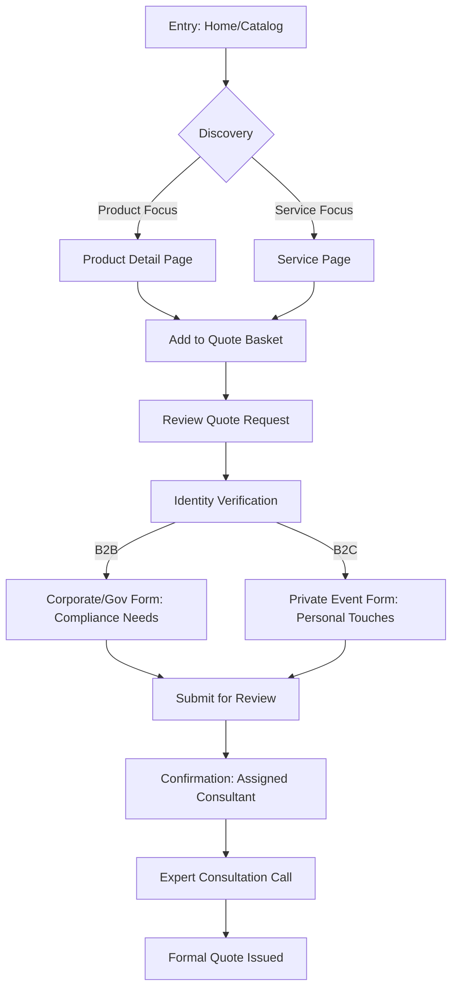

# Bonram Rentals - User Flows

These flows detail the "Quote-First" strategy to ensure a premium, consultative experience for clients.

## 1. The "Presidential" Inquiry Flow (B2B/B2C)

## 2. The "Quick-Response" Emergency Flow
*Used for load-shedding generator needs or urgent sanitation failures.*

1. **Trigger**: Floating "Immediate Assistance" Button.
2. **Action**: Single-field phone number/WhatsApp entry.
3. **Response**: Automated priority routing to operations.
4. **Outcome**: Direct contact from on-site technical team.

## 3. Navigation Philosophy
- **Implicit TRUST**: Client logos are never more than one click away.
- **Zero Friction**: Contact info is always visible, but the "Quote" process is coached/guided.
- **Validation**: Every step of the inquiry form reinforces reliability (e.g., "Our setups are government-standard").
